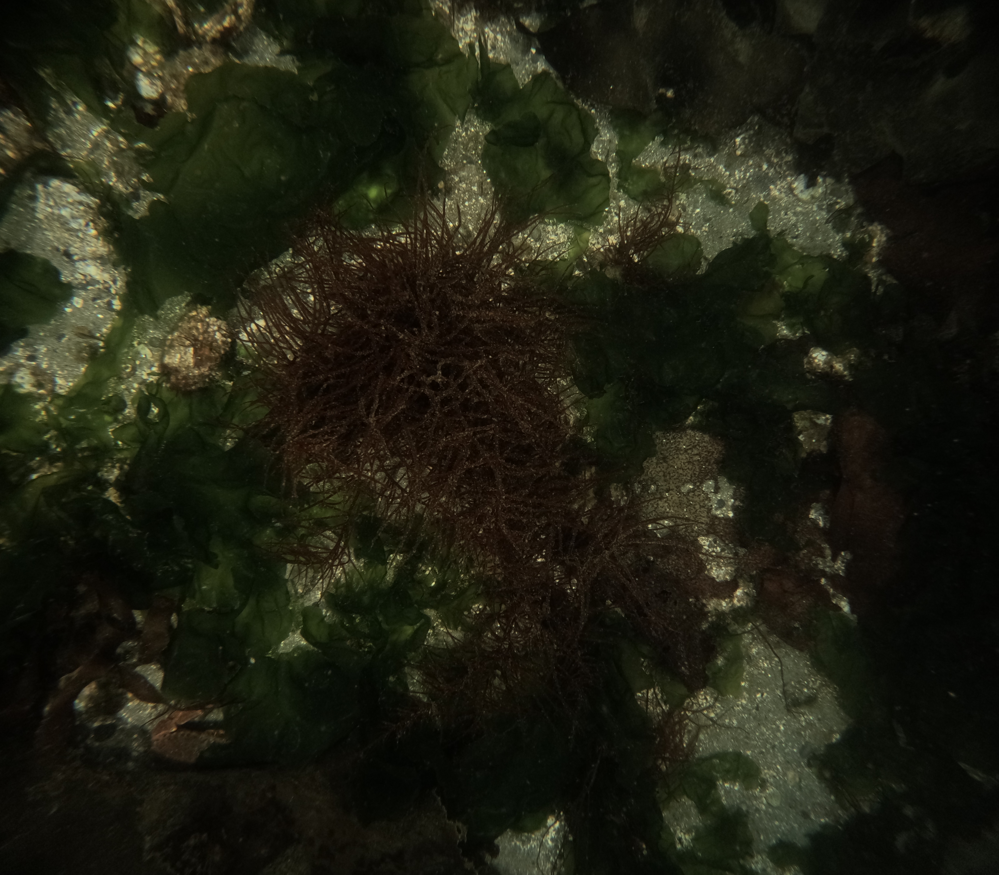

# AI/ML_image_processing

## Background
Both cameras capture RAW images at 3-second intervals across four transects, leaving us with hundreds to a 1000+ unedited `.GPR` images.
We equip our ROV with two downward-facing GoPro HERO12 cameras to take 27.3MP survey images of the seafloor, with the aim to photograph algae, invertebrates, fishes, and the underlying substrate.
The cameras capture RAW images (GoPro's General Purpose Raw, i.e., .GPR file; info [linked here](https://github.com/gopro/gpr)) at 3-second intervals, leaving us with hundreds if not thousands of unedited GPR images (the GoPro also captures a JPEG preview of each GPR photo, though these are not edited, as the GPR enables a much greater degree of post-processing).
While we batch edit these images in Adobe Lightroom Classic, each image often requires individual tuning before any meaningful data can be extracted from it with subsequent programs.
This individual editing is our workflow's most rate-limiting step. 

As an example of input and output files, see below for an unedited JPEG preview of the GPR file (left), and a JPEG output following image processing of the GPR file (right): 

  
  
 

Additionally, you can access 11 "input" photos (both GPR and the *JPEG preview) and the corresponding "output" (JPEG) [here](https://github.com/Seattle-Aquarium/CCR_development/tree/rmt_edits/files/ML_image_processing) on this repo (*the JPEG preview is only included to give you a visual idea of the GPR, as GPR photos need to be opened in software like Adobe Lightroom). 

## Existing workflow in Adobe Lightroom Classic
We start with a folder containing all GPR photos from a single ROV survey, or "transect." 
To process these photos, we 
(**1**) apply the denoise feature to all of the images; we 
(**2**) choose a single image, apply a crop to it, select a white patch to adjust white balance, and make any other necessary adjustments to tone and presence. 
We (**3**) copy the settings from this single image and paste to all others within the transect to achieve a baseline level of quality for the entire image set.
We (**4**) then need to review each photo, tuning exposure and the various settings grouped under tone (highlights, shadows, whites, blacks) to account for variation across images;
this individual tuning is the most time intensive step. 
The final results are JPEG images that have been cropped, color-corrected, denoised, and brightened significantly.
For example, you can see an example transect [here](https://www.dropbox.com/scl/fo/nkgka51g6zmk94c3je1zm/APA28IzNJSZ-_4uRkBHgLk0?rlkey=p7knm31b0la2kudx235fx3h72&st=ummi5snl&dl=0) of processed photos. 

## The Problem
The time it takes to edit a single transect's worth of imagery is the most time-consuming step in our entire workflow.
With our current methods, when we clean up one image and apply those settings to the whole transect--step (**3**) above--only images similar to the baseline image are processed to a satisfactory degree. 
Many images end up exhibiting variation away from the baseline (e.g., the ROV is closer to the seafloor, or further away) thus introducing variation in the photograph.
To ensure the quality of our imagery is consistent, we cycle through each image and fine-tune various settings. 

## The Proposed Solution
Given that we have thousands of input and output files (unprocessed GPRs, and processed JPEGs), we seek to incorporate some form of machine learning to cut down on editing time.
It is our hope that our manual edits across many images will have captured a sufficient amount of variation such that an AI/ML framework could reproduce our individualized edits on unseen imagery. 
There appear to be some AI-powered image editing software available, such as [Aftershoot](https://aftershoot.com/edit/) or [Imagen](https://imagen-ai.com/).
Additionally, a framework in Python could likely be established. 
There are a variety of options available, and we are unsure of which options ought to be explored in more detail. 